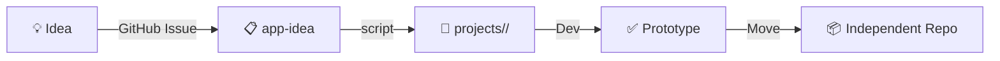

# hermes-integrations

小さなプロジェクトを集めたモノレポ。各プロジェクトは `projects/` 配下で独立して開発し、プロトタイプ完了後に独立リポジトリへ移行する。

## Workflow



1. **Idea** — GitHub Issue を `app-idea` テンプレートで投稿
2. **Scaffold** — `scripts/create-project.sh` でプロジェクトディレクトリを作成
3. **Develop** — `projects/<name>/` 内で実装
4. **Extract** — プロトタイプ完成後、独立リポジトリに移行

## Usage

```bash
# プロジェクトを作成
./scripts/create-project.sh my-app --issue https://github.com/user/hermes-integrations/issues/1

# 成果
projects/my-app/
├── src/
├── tests/
├── docs/
├── README.md
└── .gitignore
```

## ルール

- 各プロジェクトは `projects/` 配下に配置
- 標準構成: `src/`, `tests/`, `docs/`, `README.md`, `.gitignore`
- プロトタイプ完了後は独立リポジトリに分離
