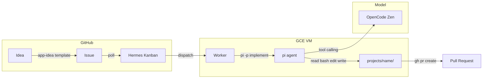

# hermes-integrations

小さなプロジェクトを集めたモノレポ。各プロジェクトは `projects/` 配下で独立して開発し、プロトタイプ完了後に独立リポジトリへ移行する。

## アーキテクチャ



| レイヤー | コンポーネント | 役割 |
|---|---|---|
| **Orchestration** | Hermes Agent (Kanban) | タスク管理、状態遷移、キューイング、リトライ |
| **Execution** | pi agent | コード生成・編集・bash実行（tool calling 内蔵） |
| **Model** | OpenCode Zen | 検証済みモデルを提供（function calling 安定） |

## ワークフロー


### Step-by-Step

1. **Idea** — GitHub Issue を `app-idea` テンプレートで投稿
2. **Scaffold** — 手動またはスクリプトでプロジェクトディレクトリを作成
   ```bash
   ./scripts/create-project.sh my-app --issue <issue_url>
   ```
3. **Enqueue** — Hermes Kanban にタスクとして追加（手動または Issue poll 経由）
   ```bash
   hermes kanban create "my-app を実装" --body "Issue #N の内容" --assignee worker
   ```
4. **Dispatch** — Worker がタスクを取得。pi-agent skill の指示に従い pi を起動
5. **PR** — 実装完了後、git commit → gh pr create
6. **Extract** — プロトタイプ完成後、独立リポジトリに移行

## 構成

```
hermes-integrations/
├── .github/ISSUE_TEMPLATE/
│   └── app-idea.md              # アプリ案のIssueテンプレート
├── scripts/
│   ├── create-project.sh        # プロジェクト雛形生成
│   └── poll-issues.sh           # Issue → Kanban 同期 (cron用)
├── projects/                    # 各プロジェクト
│   └── <name>/
│       ├── src/
│       ├── tests/
│       ├── docs/
│       ├── README.md
│       └── .gitignore
└── README.md
```

---

## GCE セットアップ手順

### 前提インストール

```bash
# Hermes Agent
curl -fsSL https://hermes-agent.sh/install | sh

# pi agent
curl -fsSL https://pi.sh/install | sh

# GitHub CLI
sudo apt install gh

# bun (pi のランタイム)
curl -fsSL https://bun.sh/install | bash
```

### OpenCode Zen の API キー設定

```bash
# ~/.bashrc または .env
export OPENCODE_API_KEY="sk-..."
export GITHUB_TOKEN="ghp_..."
```

pi のデフォルト設定:

```bash
pi config set defaultProvider opencode
pi config set defaultModel opencode/deepseek-v4-flash
```

### Hermes Kanban 初期化

```bash
hermes kanban init
hermes gateway start
```

---

## Hermes 設定詳細（GCE 実機に適用する内容）

### Worker プロファイル設定

**`~/.hermes/profiles/hermes_worker/profile.yaml`**:

```yaml
description: >
  あなたは Worker です。与えられたタスクを pi agent に委譲して実行します。
  自分でコードを書かず、terminal 経由で pi を呼び出してください。
  pi の呼び出しが完了したら結果を確認し、kanban_complete または kanban_block で
  タスクをクローズします。
description_auto: false
```

**`~/.hermes/profiles/hermes_worker/config.yaml`**（主要箇所）:

```yaml
model:
  provider: opencode
  default: opencode/deepseek-v4-flash
  base_url: https://opencode.ai/zen/v1

agent:
  max_turns: 50
  tool_use_enforcement: auto

terminal:
  backend: local
  cwd: /path/to/hermes-integrations
  timeout: 600
```

> **Worker のモデル選定**: Worker 自身はタスク解釈と `terminal` + `kanban_*` ツールの呼び出ししか行わないため、`deepseek-v4-flash` のような軽量モデルで十分。コード生成の品質は pi agent 側のモデルに依存する。

### pi-agent SKILL.md

Hermes Worker が pi の呼び出し方法を理解するためのスキルファイル。

**作成先**: `~/.hermes/skills/devops/pi-agent/SKILL.md`

```markdown
---
name: pi-agent
description: "Delegate coding to pi agent (read/bash/edit/write)."
version: 1.0.0
metadata:
  hermes:
    tags: [Coding-Agent, pi, Autonomous]
    related_skills: [kanban-worker]
---

# pi agent

pi は read / bash / edit / write のツールを持つ AI コーディングエージェント。
`pi -p "prompt"` でワンショット実行できる。

## When to Use

- 実装・コード生成・ファイル編集が必要なタスク
- テストの作成・実行
- git commit / gh pr create

## 基本コマンド

```bash
# ワンショット実行（非対話）
pi -p "タスク内容" --provider opencode --model opencode/deepseek-v4-flash

# 作業ディレクトリを指定
pi -p "タスク" --workdir "$HERMES_KANBAN_WORKSPACE"
```

## Worker の手順

1. `kanban_show()` でタスクの title / body を読む
2. タスク内容から pi に渡すプロンプトを構築
3. `terminal(command="pi -p '...'", workdir="$HERMES_KANBAN_WORKSPACE")` を実行
4. 実行結果を確認
5. 必要に応じて追加入力:
   ```bash
   pi -p "テストを実行して結果を教えて"
   ```
6. `kanban_complete(summary=..., metadata={"changed_files": [...]})` で完了

## プロンプトテンプレート

```bash
pi -p "
仕様: {task_body}

作業ディレクトリ: {workspace}

以下を実行してください:
1. 必要なファイルを作成・編集
2. テストを書いて実行
3. git add + git commit
4. gh pr create --title '{task_title}' --body 'Closes #{issue_number}'
" --provider opencode --model opencode/deepseek-v4-flash
```

## 注意

- `clarify` は使わない（ヘッドレス実行、ユーザーは不在）
- 判断が必要な場合は `kanban_comment()` + `kanban_block()` でブロック
- pi が失敗した場合、ログを確認して必要ならモデルを変えてリトライ
```

---

## Issue Poll（cron 用スクリプト）

GitHub Issue を定期的にチェックし、未処理の `app-idea` Issue を Kanban に追加する。

**`scripts/poll-issues.sh`**:

```bash
#!/usr/bin/env bash
set -euo pipefail

# 未処理の app-idea Issue を取得
gh issue list --label app-idea --state open --json number,title,body \
  | jq -c '.[]' | while read -r issue; do

  NUMBER=$(echo "$issue" | jq -r '.number')
  TITLE=$(echo "$issue" | jq -r '.title')
  BODY=$(echo "$issue" | jq -r '.body')

  # 既に Kanban に存在するかチェック（task title に Issue 番号を含める）
  if hermes kanban list --status todo,ready --json \
    | jq -e ".[] | select(.title | contains(\"#$NUMBER\"))" > /dev/null 2>&1; then
    continue
  fi

  # プロジェクト名を抽出 or 生成
  PROJECT_NAME=$(echo "$TITLE" | sed 's/\[App\] //' | tr 'A-Z' 'a-z' | tr ' ' '-')

  # プロジェクトディレクトリがなければ作成
  if [ ! -d "projects/$PROJECT_NAME" ]; then
    ./scripts/create-project.sh "$PROJECT_NAME" --issue "https://github.com/$GITHUB_REPOSITORY/issues/$NUMBER"
  fi

  # Kanban にタスク追加
  hermes kanban create \
    "$PROJECT_NAME を実装 (#$NUMBER)" \
    --body "$BODY" \
    --assignee worker

  # Issue にコメント
  gh issue comment "$NUMBER" --body "🤖 Kanban タスクを作成しました"
done
```

**cron 設定**（`crontab -e`）:

```cron
*/5 * * * * cd /path/to/hermes-integrations && bash scripts/poll-issues.sh >> /var/log/poll-issues.log 2>&1
```

---

## モデル戦略

| 役割 | モデル | 理由 |
|---|---|---|
| **Hermes Worker** | `opencode/deepseek-v4-flash` ($0.14/$0.28) | タスク解釈 + ツール呼び出しのみ。安くて十分 |
| **pi agent (実装)** | `opencode/deepseek-v4-flash` | コスパ重視。デイリー開発向け |
| **pi agent (難しいタスク)** | `opencode/claude-sonnet-5` ($2/$10) | 複雑な実装・精度が必要な場合 |
| **テスト・軽作業** | `opencode/deepseek-v4-flash-free` (無料) | 期間限定だがコストゼロ |

pi 呼び出し時に `--model` で切り替え:

```bash
# 通常
pi -p "..." --provider opencode --model opencode/deepseek-v4-flash

# 精度重視
pi -p "..." --provider opencode --model opencode/claude-sonnet-5
```

---

## 課題と対策

### LM Studio の function calling 問題

Qwen3.5-9B / Gemma-4-26B などローカルモデルは function calling が不安定で、
`execute\n ls -la` のようにコマンドをテキストで書いて終わってしまう。

**原因**: 小規模ローカルモデルは tool use の指示を正しく解釈できず、テキスト応答に退避する。

**対策**: Hermes Kanban はタスク管理に専念させ、実際のコード生成は pi agent（→ OpenCode Zen）に委譲するハイブリッド構成。pi は独自の tool calling 機構を持ち、モデルに依存しない安定動作が可能。

### Worker モデルが弱い場合

Worker 自身もツール呼び出しが必要。`deepseek-v4-flash-free` でも基本ツール（terminal, kanban_*）はこなせるが、不安定な場合は Worker に `claude-sonnet-5` を使う。

---

## ルール

- 各プロジェクトは `projects/` 配下に配置
- 標準構成: `src/`, `tests/`, `docs/`, `README.md`, `.gitignore`
- プロトタイプ完了後は独立リポジトリに分離
