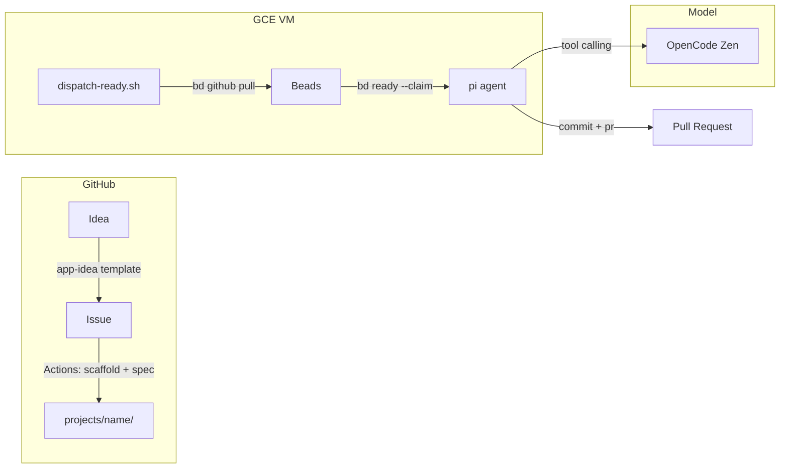
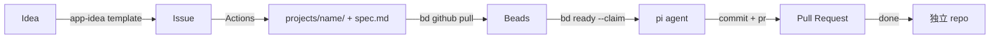

# hermes-integrations

小さなプロジェクトを集めたモノレポ。各プロジェクトは `projects/` 配下で独立して開発し、プロトタイプ完了後に独立リポジトリへ移行する。

## アーキテクチャ



| レイヤー | コンポーネント | 役割 |
|---|---|---|
| **Trigger** | GitHub Actions | Issue 検出 → project scaffold + spec 生成 |
| **Orchestration** | Beads (`bd`) | 依存関係対応のイシュートラッカー、ready work ディスパッチ |
| **Execution** | pi agent | コード生成・編集・bash実行 |
| **Model** | OpenCode Zen | 検証済みモデルを提供（function calling 安定） |

## ワークフロー



### Step-by-Step

1. **Idea** — GitHub Issue を `app-idea` テンプレートで投稿
2. **Scaffold + Spec (auto)** — GitHub Actions が `create-project.sh` + `generate-spec.sh` を実行 → `projects/` にコミット
3. **Sync (auto)** — GCE の cron (`dispatch-ready.sh`) が `bd github pull` で GitHub Issues → Beads に同期
4. **Claim (auto)** — `bd ready --claim` で unblocked work を取得
5. **Implement (auto)** — pi agent が spec.md を読み、実装・テスト・commit・PR
6. **Extract** — プロトタイプ完成後、独立リポジトリに移行

手動実行も可能:

```bash
# scaffold
./scripts/create-project.sh my-app --issue <issue_url>

# spec 生成
export OPENROUTER_API_KEY="sk-..."
ISSUE_BODY="$(gh issue view 42 --json body -q .body)"
ISSUE_BODY="$ISSUE_BODY" bash scripts/generate-spec.sh my-app 42

# dispatch ready work
bash scripts/dispatch-ready.sh
```

## 構成

```
hermes-integrations/
├── .github/
│   ├── ISSUE_TEMPLATE/
│   │   └── app-idea.md              # アプリ案のIssueテンプレート
│   └── workflows/
│       └── app-idea.yml             # Issue → scaffold + spec (Actions)
├── scripts/
│   ├── create-project.sh            # プロジェクト雛形生成
│   ├── generate-spec.sh             # Issue → spec.md (OpenRouter API)
│   └── dispatch-ready.sh            # Beads sync + ready work dispatch (GCE cron)
├── projects/                        # 各プロジェクト
│   └── <name>/
│       ├── src/
│       ├── tests/
│       ├── docs/
│       │   └── spec.md              # 実装スペック
│       ├── README.md
│       └── .gitignore
├── AGENTS.md                        # AI エージェント向けガイドライン
└── README.md
```

---

## GitHub Actions

Issue に `app-idea` ラベルが付与された時（テンプレート投稿時または後付）に起動。

**トリガー条件:**

| Event | 動作 |
|---|---|
| Issue opened (テンプレート使用時) | 自動起動（`app-idea` ラベル付き） |
| 後から `app-idea` ラベル追加 | 起動 |
| Issue 編集 | 起動しない（再実行したい場合はラベルの付け直し） |

**処理内容:**

1. `create-project.sh` でプロジェクトディレクトリを生成
2. `generate-spec.sh` で OpenRouter API → `docs/spec.md` を生成
3. `projects/` をコミット＆プッシュ
4. Issue にコメントを投稿

---

## GCE セットアップ手順

### インストール

```bash
# Beads
curl -fsSL https://raw.githubusercontent.com/gastownhall/beads/main/scripts/install.sh | bash

# pi agent
curl -fsSL https://pi.sh/install | sh

# bun (pi のランタイム)
curl -fsSL https://bun.sh/install | bash

# GitHub CLI
sudo apt install gh
```

### Beads 初期化

```bash
cd ~/Sources/hermes-integrations
bd init --quiet
```

### GitHub 接続設定

```bash
# Fine-grained token (Issues: Read & Write)
export GITHUB_TOKEN="ghp_..."

bd config set github.owner "dohzoh"
bd config set github.repo "hermes-integrations"
bd github status    # 確認
```

### OpenCode Zen の API キー設定

```bash
export OPENCODE_API_KEY="sk-..."
```

pi のデフォルト設定:

```bash
pi config set defaultProvider opencode
pi config set defaultModel opencode/deepseek-v4-flash
```

### cron 登録

```bash
crontab -e
# 以下を追加:
*/5 * * * * cd /home/dozo/Sources/hermes-integrations && bash scripts/dispatch-ready.sh >> /var/log/dispatch-ready.log 2>&1
```

---

## スクリプト

### `create-project.sh`

プロジェクトの雛形ディレクトリを生成する。

```bash
./scripts/create-project.sh my-app --issue https://github.com/owner/repo/issues/42
```

### `generate-spec.sh`

GitHub Issue の本文を OpenRouter API に投げ、`docs/spec.md` を生成する。

```bash
export OPENROUTER_API_KEY="sk-..."
ISSUE_BODY="$(gh issue view 42 --json body -q .body)"
ISSUE_BODY="$ISSUE_BODY" bash scripts/generate-spec.sh my-app 42
```

モデルの変更:

```bash
export OPENROUTER_MODEL="google/gemini-2.5-pro"
```

### `dispatch-ready.sh`

Beads で ready work を取得し、pi agent にディスパッチする（GCE cron ターゲット）。

```bash
bash scripts/dispatch-ready.sh
```

処理:
1. `bd github pull` — GitHub Issues → Beads に同期
2. `bd ready --claim --json` — unblocked work をアトミックに取得
3. `pi -p "..." --workdir projects/<name>` — 実装
4. `bd close` — 完了処理

---

## モデル戦略

| 役割 | モデル | 理由 |
|---|---|---|
| **pi agent (通常)** | `opencode/deepseek-v4-flash` | コスパ重視。デイリー開発向け |
| **pi agent (難しいタスク)** | `opencode/claude-sonnet-5` | 複雑な実装・精度が必要な場合 |
| **spec 生成** | `google/gemini-2.0-flash-001` (OpenRouter) | 安価・高速 |

pi 呼び出し時に `--model` で切り替え:

```bash
# 通常
pi -p "..." --provider opencode --model opencode/deepseek-v4-flash

# 精度重視
pi -p "..." --provider opencode --model opencode/claude-sonnet-5
```

---

## ルール

- 各プロジェクトは `projects/` 配下に配置
- 標準構成: `src/`, `tests/`, `docs/`, `README.md`, `.gitignore`
- プロトタイプ完了後は独立リポジトリに分離
