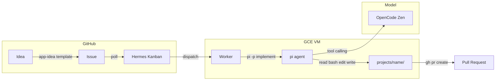
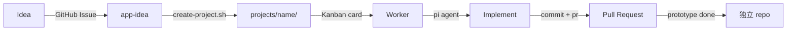

# hermes-integrations

小さなプロジェクトを集めたモノレポ。各プロジェクトは `projects/` 配下で独立して開発し、プロトタイプ完了後に独立リポジトリへ移行する。

## アーキテクチャ



| レイヤー | コンポーネント | 役割 |
|---|---|---|
| **Orchestration** | Hermes Agent (Kanban) | タスク管理、状態遷移、キューイング、リトライ |
| **Execution** | pi agent | コード生成・編集・bash実行（tool calling 内蔵） |
| **Model** | OpenCode Zen | 検証済みモデルを提供（function calling 安定） |

## ワークフロー



### Step-by-Step

1. **Idea** — GitHub Issue を `app-idea` テンプレートで投稿
2. **Scaffold** — `scripts/create-project.sh` でプロジェクトディレクトリを作成
   ```bash
   ./scripts/create-project.sh my-app --issue <issue_url>
   ```
3. **Enqueue** — Hermes Kanban にタスクとして追加
   ```bash
   hermes kanban create "Implement my-app" --assignee worker
   ```
4. **Dispatch** — Worker がタスクを取得、pi agent で実装を実行
   ```bash
   # Worker 内部で実行されるコマンド（イメージ）
   pi -p "Implement the spec in projects/my-app/ based on Issue #N" \
     --provider opencode --model opencode/deepseek-v4-flash
   ```
5. **PR** — 実装完了後、git commit + gh pr create
6. **Extract** — プロトタイプ完成後、独立リポジトリに移行

## 構成

```
hermes-integrations/
├── .github/ISSUE_TEMPLATE/
│   └── app-idea.md          # アプリ案のIssueテンプレート
├── scripts/
│   └── create-project.sh    # プロジェクト雛形生成スクリプト
├── projects/
│   └── <project-name>/      # 各プロジェクト
│       ├── src/
│       ├── tests/
│       ├── docs/
│       ├── README.md
│       └── .gitignore
└── README.md
```

## セットアップ

### 前提

- Hermes Agent v0.18.0+（`~/.hermes/` に設定済み）
- pi agent v0.80.2+（`/home/dozo/.bun/bin/pi`）
- OpenCode Zen API キー（`OPENCODE_API_KEY`）

### Hermes Kanban 初期化

```bash
hermes kanban init
hermes gateway start
```

### pi agent の設定

`~/.pi/agent/settings.json`:

```json
{
  "defaultProvider": "opencode",
  "defaultModel": "opencode/deepseek-v4-flash"
}
```

または実行時指定:

```bash
pi -p "task" --provider opencode --model opencode/claude-sonnet-5
```

### 環境変数

```bash
# OpenCode Zen
export OPENCODE_API_KEY="sk-..."

# GitHub CLI
export GITHUB_TOKEN="ghp_..."
```

## モデル

OpenCode Zen 経由。pi agent の tool calling で実績のあるモデル:

| モデル | ID | 価格 (input/output per 1M) | 用途 |
|---|---|---|---|
| **Claude Sonnet 5** | `opencode/claude-sonnet-5` | $2/$10 | 最優先・function calling 最高 |
| **DeepSeek V4 Flash** | `opencode/deepseek-v4-flash` | $0.14/$0.28 | 格安・デイリー開発向け |
| **GPT 5.4 Mini** | `opencode/gpt-5.4-mini` | $0.75/$4.50 | バランス型 |
| **Big Pickle** | `opencode/big-pickle` | 無料 | 期間限定・テスト向け |

pi の呼び出し例:

```bash
pi -p "Write implementation" \
  --provider opencode \
  --model opencode/claude-sonnet-5
```

## 課題と対策

### LM Studio の function calling 問題

Qwen3.5-9B / Gemma-4-26B などローカルモデルは function calling が不安定で、
`execute\n ls -la` のようにコマンドをテキストで書いて終わってしまう。

**対策**: Hermes Kanban はタスク管理に専念させ、実際のコード生成は pi agent（→ OpenCode Zen）に委譲するハイブリッド構成。pi は独自の tool calling 機構を持ち、モデルに依存しない安定動作が可能。

## ルール

- 各プロジェクトは `projects/` 配下に配置
- 標準構成: `src/`, `tests/`, `docs/`, `README.md`, `.gitignore`
- プロトタイプ完了後は独立リポジトリに分離
